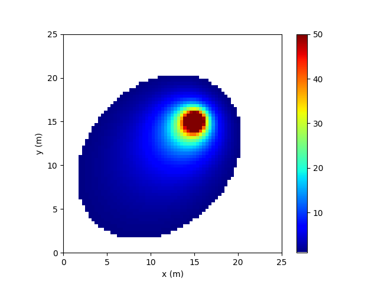
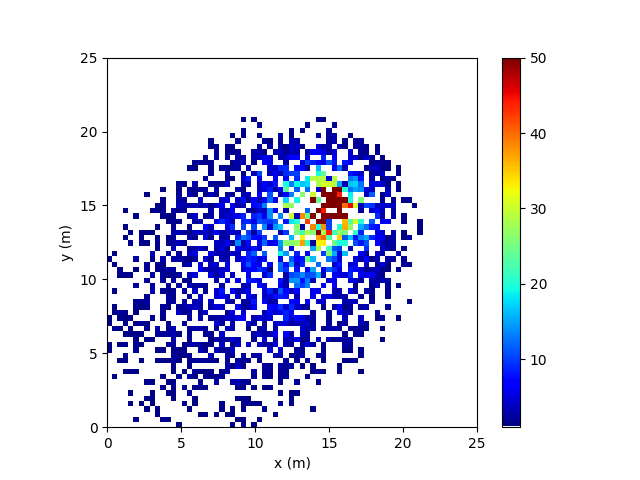

# Source-Term-Estimation-for-RL
The Environment of Source Term Estimation (STE) for RL

The STE environments for the discrete and continuous action spaces are implemented in folder STE_Env_continuous discrete and folder STE_Env_continuous, respectively.

## Latest Version
<figure>
  
  <figcaption>Map of plume model</figcaption>
</figure>

<figure>
  
  <figcaption>Map of sensor map</figcaption>
</figure>

The action in the discrete action space is [front, back, left, right].  

The action in continuous action space is $` r sin\theta `$, $` r `$ denotes speed, $` \theta \in [-\pi,\pi]`$

Only when the robot successfully estimates the source term, the reward is +100; otherwise, the reward for each step is -1.

For specific details, see [Information-theoretic search of an atmospheric release using a mobile sensor] (https://github.com/Cunjia-Liu/AutoSTE#information-theoretic-search-of-an-atmospheric-release-using-a-mobile-sensor).
The code in the link (from Prof. Cunjia's github) is the Matlab version, a python version of the code is given in the folder AutoSTE_python
