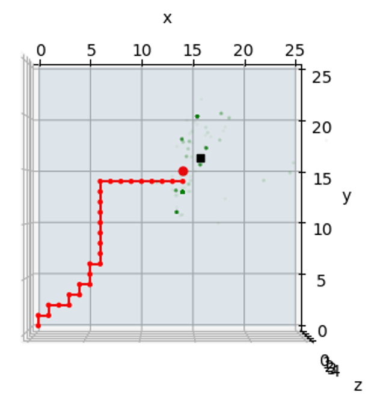

# Source-Term-Estimation-for-RL
The Environment of Source Term Estimation (STE) for RL

The STE environments for the **discrete and** **continuous action** spaces are implemented in folder **STE_Env_continuous discrete** and folder **STE_Env_continuous**, respectively.

## Map of Map of plume mode and map of sensor map 
<figure>
  
  <figcaption>Map of plume model</figcaption>
</figure>

<figure>
  
  <figcaption>Map of sensor map</figcaption>
</figure>

## Scene Renderer Interface
<figure>
  
  <figcaption>Scene Renderer Interface (Discrete)</figcaption>
</figure>  
The red dots are the position of the robot at each step, the black squares are the position of the SOURCE TERM (which is not known to the robot or Agent), and the green dots are the particles for particle filtering.

<figure>
  
  <figcaption>Scene Renderer Interface (Continuous)</figcaption>
</figure>  

## Action space
The action in the discrete action space is [front, back, left, right].  

The action in continuous action space is $` r sin\theta `$, $` r `$ denotes speed, $` \theta \in [-\pi,\pi]`$.

## References and links
Only when the robot successfully estimates the source term, the reward is +100; otherwise, the reward for each step is -1.

For specific details, see [Information-theoretic search of an atmospheric release using a mobile sensor] (https://github.com/Cunjia-Liu/AutoSTE#information-theoretic-search-of-an-atmospheric-release-using-a-mobile-sensor).
The code in the link (**from Prof. Cunjia's github**) is the **Matlab version**, **a Python version** of the code is given in the folder **AutoSTE_python**
